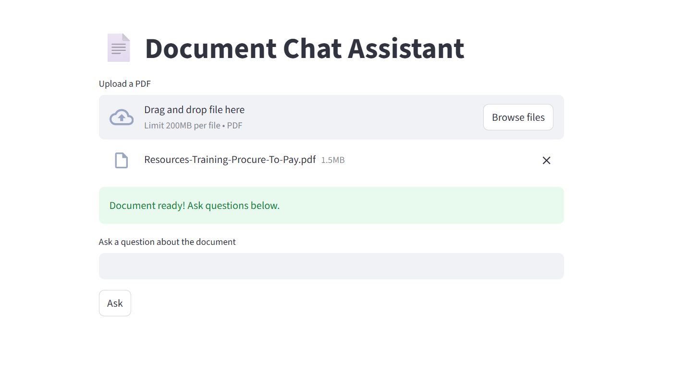
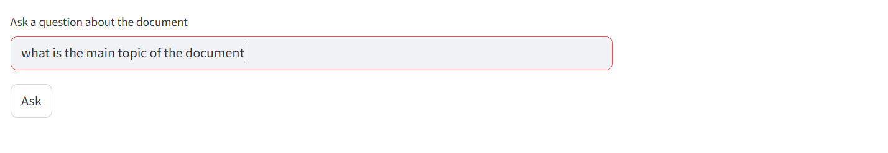
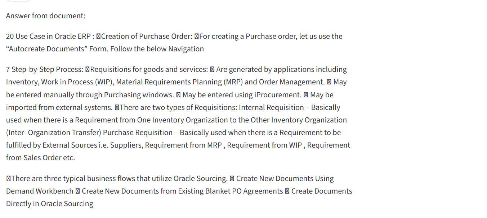

 Document Chat Assistant (RAG)

Ask questions from any PDF — get accurate answers directly from the document.

🔗 Live App: http://13.49.14.78

 API Docs: http://13.49.14.78/docs

 Problem

  * Large documents are difficult to search manually.
  * Traditional keyword search cannot understand context or meaning.

Solution

    * Built a Retrieval Augmented Generation (RAG) system that understands user queries semantically and retrieves the most relevant sections from uploaded PDFs to generate grounded answers.

 What Makes This Different

  * Unlike typical chatbots, this system does not hallucinate.
  * Every answer comes directly from the document using vector similarity search.

What This Project Does

Upload a PDF → Ask a question → Retrieve relevant sections → Return contextual answer

 How It Works
  PDF → Text Extraction → Chunking → Embeddings → FAISS Index
                                         ↑
  Question → Embedding → Similarity Search → Context → Answer

 Tech Stack
  * Backend

  * FastAPI

  * LangChain

  * Sentence-Transformers (MiniLM)

  * FAISS Vector Store

  * Frontend

  * Streamlit

Deployment

  * AWS EC2 (Ubuntu)

  * Nginx Reverse Proxy

  * Background services (tmux)

 Features

  * Upload any PDF

  * Semantic document search

  * Context-grounded answers

  * Interactive UI

  * Live deployed API

▶️ Run Locally
git clone https://github.com/HariniRaajesh/Rag_document_assistant.git
cd Rag_document_assistant

pip install -r requirements.txt

# backend
uvicorn backend.main:app --reload

# frontend
streamlit run frontend/app.py

 Use Cases

  * Knowledge base assistants

  * Research paper Q&A

  * Legal document analysis

  * Resume screening tools

## Demo

### Upload

### Question

### Answer

👩‍💻 Author

  Harini

